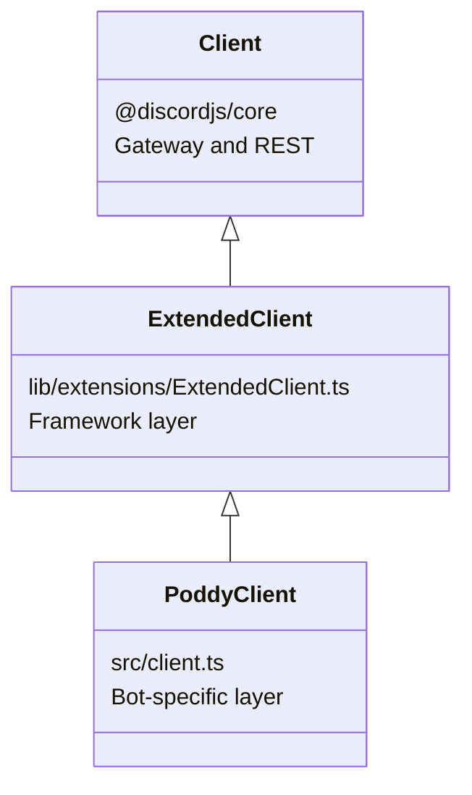

Poddy's client architecture uses inheritance to separate framework-level functionality from bot-specific features.

## Client hierarchy

The client hierarchy consists of three layers:



### 1. Client (@discordjs/core)

The base Discord client from `@discordjs/core` that handles gateway connections and REST API communication.

### 2. ExtendedClient (Framework)

Extends the base Client with framework-level functionality that any bot could use.

**Location:** `lib/extensions/ExtendedClient.ts`

### 3. PoddyClient (Bot-specific)

Extends ExtendedClient with Poddy-specific functionality like Zendesk integration and BetterStack monitoring.

**Location:** `src/client.ts`

## ExtendedClient

ExtendedClient is the core of the framework layer. It provides all the infrastructure needed to build a Discord bot.

### Key properties

<Tabs>
  <Tab title="API & Database">
    ```typescript lib/extensions/ExtendedClient.ts
    export default class ExtendedClient extends Client {
      // Discord API client
      public override readonly api: API;
      
      // Prisma ORM for PostgreSQL
      public readonly prisma: TypedPrismaClientOnlyATypeDoNotUse;
      
      // Bot configuration
      public readonly config: typeof botConfig;
      
      // Logger with Sentry integration
      public readonly logger: typeof Logger;
    }
    ```
  </Tab>
  
  <Tab title="Handlers">
    ```typescript lib/extensions/ExtendedClient.ts
    export default class ExtendedClient extends Client {
      // Application command handler
      public readonly applicationCommandHandler: ApplicationCommandHandler<this>;
      
      // Button handler
      public readonly buttonHandler: ButtonHandler<this>;
      
      // Modal handler
      public readonly modalHandler: ModalHandler<this>;
      
      // Select menu handler
      public readonly selectMenuHandler: SelectMenuHandler<this>;
      
      // Autocomplete handler
      public readonly autoCompleteHandler: AutoCompleteHandler<this>;
      
      // Text command handler
      public readonly textCommandHandler: TextCommandHandler<this>;
    }
    ```
  </Tab>
  
  <Tab title="Collections">
    ```typescript lib/extensions/ExtendedClient.ts
    export default class ExtendedClient extends Client {
      // Application commands mapped by ${name}-${type}
      public applicationCommands: Map<string, ApplicationCommand>;
      
      // Buttons mapped by name
      public readonly buttons: Map<string, Button>;
      
      // Modals mapped by name
      public readonly modals: Map<string, Modal>;
      
      // Select menus mapped by name
      public readonly selectMenus: Map<string, SelectMenu>;
      
      // Gateway events
      public events: Map<keyof MappedEvents, EventHandler<this>>;
    }
    ```
  </Tab>
  
  <Tab title="Caches">
    ```typescript lib/extensions/ExtendedClient.ts
    export default class ExtendedClient extends Client {
      // Guild ID -> Owner ID
      public guildOwnersCache: Map<string, string>;
      
      // Guild ID -> Map of roles
      public guildRolesCache: Map<string, Map<string, APIRole>>;
      
      // Guild ID -> Bot member object
      public guildMeCache: Map<string, APIGuildMember>;
      
      // Channel ID -> Channel name (30s TTL)
      public readonly channelNameCache: Map<string, string>;
    }
    ```
  </Tab>
</Tabs>

### Constructor and initialization

The ExtendedClient constructor sets up all handlers and initializes the framework:

```typescript lib/extensions/ExtendedClient.ts
public constructor({ rest, gateway, options }: ClientOptions & { options: BotOptions }) {
  super({ rest, gateway });

  this.api = new API(rest);
  this.config = botConfig;
  this.logger = Logger;
  
  // Initialize Prisma with connection pooling
  this.prisma = new PrismaClient({
    adapter: new PrismaPg({ connectionString: env.DATABASE_URL }),
    log: [
      { level: "warn", emit: "stdout" },
      { level: "error", emit: "stdout" },
      { level: "query", emit: "event" },
    ],
  });
  
  // Initialize all handlers
  this.applicationCommandHandler = new ApplicationCommandHandler(this);
  this.buttonHandler = new ButtonHandler(this);
  this.modalHandler = new ModalHandler(this);
  this.selectMenuHandler = new SelectMenuHandler(this);
  // ... other handlers
  
  // Load events
  void this.loadEvents();
}
```

### Start method

The `start()` method initializes i18n and loads all handlers:

```typescript lib/extensions/ExtendedClient.ts
public async start() {
  await this.i18n.use(intervalPlural).init({
    fallbackLng: "en-US",
    resources: {},
    fallbackNS: this.config.botName.toLowerCase().split(" ").join("_"),
    lng: "en-US",
  });

  await this.languageHandler.loadLanguages();
  await this.autoCompleteHandler.loadAutoCompletes();
  await this.applicationCommandHandler.loadApplicationCommands();
  await this.textCommandHandler.loadTextCommands();
  await this.buttonHandler.loadButtons();
  await this.selectMenuHandler.loadSelectMenus();
  await this.modalHandler.loadModals();
}
```

### Functions getter

ExtendedClient provides a `functions` getter that returns a new Functions instance:

```typescript lib/extensions/ExtendedClient.ts
get functions() {
  return new Functions(this);
}
```

<Info>
  PoddyClient overrides this getter to return `PoddyFunctions` instead, which extends the base Functions class with Poddy-specific utilities.
</Info>

## PoddyClient

PoddyClient extends ExtendedClient with minimal bot-specific customization. Currently, it only overrides the `functions` getter.

**Location:** `src/client.ts`

```typescript src/client.ts
import ExtendedClient from "../lib/extensions/ExtendedClient.js";
import PoddyFunctions from "./utilities/functions.js";

export class PoddyClient extends ExtendedClient {
  override get functions(): PoddyFunctions {
    return new PoddyFunctions(this);
  }
}
```

### Why override functions?

By overriding the `functions` getter, PoddyClient provides access to Poddy-specific utilities:

- **Zendesk integration** - Create tickets, upload attachments
- **BetterStack** - Fetch incident status
- **GraphQL queries** - RunPod API integration
- **Thread management** - Fetch all thread messages

<Tabs>
  <Tab title="Base Functions">
    ```typescript lib/utilities/functions.ts
    export default class Functions {
      constructor(client: ExtendedClient) {
        this.client = client;
      }
      
      // Generic utility methods
      getFiles(dir: string, ext: string, recursive?: boolean): string[]
      format(time: number, short: boolean, language: Language): string
      // ... other utilities
    }
    ```
  </Tab>
  
  <Tab title="PoddyFunctions">
    ```typescript src/utilities/functions.ts
    export default class PoddyFunctions extends Functions {
      constructor(client: PoddyClient) {
        super(client);
        this.client = client;
      }
      
      // Zendesk integration
      async submitTicket(type, email, staffUser, id, interaction, options)
      async uploadAttachmentsToZendesk(attachments)
      async addTicketInternalNote(ticketId, message)
      
      // Thread utilities
      async fetchAllThreadMessages(threadId, options)
      
      // BetterStack
      async fetchIncidentStatus()
      // ... other Poddy-specific methods
    }
    ```
  </Tab>
</Tabs>

## Using the client in handlers

All base classes (Button, Modal, ApplicationCommand, etc.) accept a generic type parameter for the client:

```typescript
export default class Button<C extends ExtendedClient = ExtendedClient> {
  public readonly client: C;
  
  public constructor(client: C, options: { name: string }) {
    this.client = client;
    this.name = options.name;
  }
}
```

When creating a Poddy-specific handler, use the `PoddyClient` type to get access to PoddyFunctions:

<CodeGroup>
```typescript src/bot/buttons/zendesk/escalateToZendesk.ts
import Button from "@lib/classes/Button.js";
import type { PoddyClient } from "@src/client.js";

export default class EscalateToZendesk extends Button<PoddyClient> {
  public constructor(client: PoddyClient) {
    super(client, { name: "escalateToZendesk" });
  }

  public override async run({ interaction }) {
    // Access Poddy-specific functions
    const uploadTokens = await this.client.functions.uploadAttachmentsToZendesk(
      message.attachments
    );
    
    await this.client.functions.submitTicket(
      type, email, staffUser, id, interaction, options
    );
  }
}
```

```typescript src/bot/buttons/events/upvote.ts
import Button from "@lib/classes/Button.js";
import type ExtendedClient from "@lib/extensions/ExtendedClient.js";

// Generic button that doesn't need Poddy-specific functions
export default class Upvote extends Button {
  public constructor(client: ExtendedClient) {
    super(client, { name: "upvote" });
  }

  public override async run({ interaction }) {
    // Only uses base client functionality
    await this.client.prisma.submissionUpvote.upsert({
      where: { userId_eventId: { userId, eventId } },
      create: { userId, eventId, submissionId },
      update: { submissionId },
    });
  }
}
```
</CodeGroup>

<Note>
  Use `Button<PoddyClient>` when you need access to `this.client.functions` methods from PoddyFunctions. Otherwise, use the default `Button` (which uses `ExtendedClient`).
</Note>

## Summary

- **Client** - Base Discord.js client from `@discordjs/core`
- **ExtendedClient** - Framework layer with handlers, database, i18n, caching
- **PoddyClient** - Bot-specific layer with Zendesk, BetterStack, and RunPod integrations
- **Functions vs PoddyFunctions** - Generic utilities vs bot-specific utilities

<Card title="Next: Handler system" icon="arrow-right" href="/architecture/handlers">
  Learn how handlers load, validate, and execute interactions
</Card>