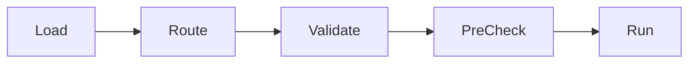

Handlers are responsible for loading, routing, validating, and executing interactions. Each interaction type has a dedicated handler class.

## Handler types

Poddy includes six handler classes:

<CardGroup cols={2}>
  <Card title="ApplicationCommandHandler" icon="slash">
    Slash commands and context menus
  </Card>
  <Card title="ButtonHandler" icon="square">
    Button interactions
  </Card>
  <Card title="ModalHandler" icon="window">
    Modal submit interactions
  </Card>
  <Card title="SelectMenuHandler" icon="list">
    Select menu interactions
  </Card>
  <Card title="AutoCompleteHandler" icon="magnifying-glass">
    Command option autocomplete
  </Card>
  <Card title="TextCommandHandler" icon="terminal">
    Prefix-based text commands
  </Card>
</CardGroup>

## Handler lifecycle

All handlers follow a consistent lifecycle:



### 1. Load

Handlers scan the appropriate directory and instantiate all interaction classes:

```typescript lib/classes/ButtonHandler.ts
public async loadButtons() {
  const baseDir = `${this.client.__dirname}/dist/src/bot/buttons`;
  for (const parentFolder of this.client.functions.getFiles(baseDir, "", true)) {
    const parentDir = `${baseDir}/${parentFolder}`;
    for (const fileName of this.client.functions.getFiles(parentDir, ".js")) {
      const ButtonFile = await import(`${parentDir}/${fileName}`);
      const button = new ButtonFile.default(this.client) as Button;
      this.client.buttons.set(button.name, button);
    }
  }
}
```

<Note>
  All handlers load files from `dist/src/bot/{type}/` after TypeScript compilation. The directory structure uses categories (folders) to organize interactions.
</Note>

### 2. Route

When an interaction is received, the handler routes it to the correct interaction instance:

<Tabs>
  <Tab title="ButtonHandler">
    ```typescript lib/classes/ButtonHandler.ts
    private async getButton(customId: string) {
      return [...this.client.buttons.values()].find((button) => 
        customId.startsWith(button.name)
      );
    }
    ```
    
    Matches based on `custom_id.startsWith(button.name)`
  </Tab>
  
  <Tab title="ApplicationCommandHandler">
    ```typescript lib/classes/ApplicationCommandHandler.ts
    private getApplicationCommand(name: string, type: number) {
      return this.client.applicationCommands.get(`${name}-${type}`);
    }
    ```
    
    Matches based on `${name}-${type}` key
  </Tab>
  
  <Tab title="ModalHandler">
    ```typescript lib/classes/ModalHandler.ts
    private async getModal(customId: string) {
      return [...this.client.modals.values()].find((modal) => 
        customId.startsWith(modal.name)
      );
    }
    ```
    
    Matches based on `custom_id.startsWith(modal.name)`
  </Tab>
</Tabs>

<Info>
  See [Interaction routing](/architecture/interaction-routing) for details on how custom_id matching works.
</Info>

### 3. Validate

The handler calls the interaction's `validate()` method to check permissions and prerequisites:

```typescript lib/classes/ButtonHandler.ts
const missingPermissions = await button.validate({
  interaction,
  language,
  shardId,
});

if (missingPermissions) {
  return this.client.api.interactions.reply(interaction.id, interaction.token, {
    embeds: [{
      ...missingPermissions,
      color: this.client.config.colors.error,
    }],
    flags: MessageFlags.Ephemeral,
  });
}
```

The `validate()` method checks:
- Developer-only restrictions (`devOnly`)
- Owner-only restrictions (`ownerOnly`)
- User permissions (`permissions`)
- Client permissions (`clientPermissions`)
- Cooldowns (for ApplicationCommands)

### 4. PreCheck

The handler calls the interaction's `preCheck()` method for custom validation logic:

```typescript lib/classes/ButtonHandler.ts
const [preChecked, preCheckedResponse] = await button.preCheck({
  interaction,
  language,
  shardId,
});

if (!preChecked) {
  if (preCheckedResponse) {
    await this.client.api.interactions.reply(interaction.id, interaction.token, {
      embeds: [{
        ...preCheckedResponse,
        color: this.client.config.colors.error,
      }],
      flags: MessageFlags.Ephemeral,
    });
  }
  return;
}
```

<Note>
  `preCheck()` is optional and defaults to `[true]`. Override it in your interaction class to add custom validation logic.
</Note>

### 5. Run

Finally, the handler executes the interaction's `run()` method:

```typescript lib/classes/ButtonHandler.ts
private async runButton(
  button: Button,
  interaction: APIMessageComponentButtonInteraction,
  shardId: number,
  language: Language,
) {
  if (this.cooldowns.has((interaction.member ?? interaction).user!.id)) {
    return this.client.api.interactions.reply(/* cooldown message */);
  }

  try {
    await button.run({ interaction, language, shardId });
  } catch (error) {
    // Error handling with Sentry
    this.client.logger.error(error);
    const eventId = await this.client.logger.sentry.captureWithInteraction(
      error, 
      interaction
    );
    // ... send error message to user
  }

  // Apply cooldown
  this.cooldowns.add((interaction.member ?? interaction).user!.id);
  setTimeout(
    () => this.cooldowns.delete((interaction.member ?? interaction).user!.id),
    this.coolDownTime
  );
}
```

## Handler constructor

All handlers follow a consistent constructor pattern:

```typescript lib/classes/ButtonHandler.ts
export default class ButtonHandler<C extends ExtendedClient = ExtendedClient> {
  public readonly client: C;
  public readonly coolDownTime: number;
  public readonly cooldowns: Set<string>;

  public constructor(client: C) {
    this.client = client;
    this.coolDownTime = 200; // 200ms cooldown
    this.cooldowns = new Set();
  }
}
```

<Info>
  The 200ms cooldown prevents users from spamming interactions. This is separate from command-specific cooldowns defined in ApplicationCommand.
</Info>

## Error handling

All handlers implement comprehensive error handling:

1. **Try-catch around run()** - Catches any errors during execution
2. **Sentry integration** - Captures errors with interaction context
3. **User feedback** - Sends error embed with Sentry event ID
4. **Fallback to followUp** - If initial reply fails, tries followUp

```typescript lib/classes/ButtonHandler.ts
try {
  await button.run({ interaction, language, shardId });
} catch (error) {
  this.client.logger.error(error);
  const eventId = await this.client.logger.sentry.captureWithInteraction(
    error,
    interaction
  );

  const toSend = {
    embeds: [{
      title: language.get("AN_ERROR_HAS_OCCURRED_TITLE"),
      description: language.get("AN_ERROR_HAS_OCCURRED_DESCRIPTION"),
      footer: { text: language.get("SENTRY_EVENT_ID_FOOTER", { eventId }) },
      color: this.client.config.colors.error,
    }],
    flags: MessageFlags.Ephemeral,
  };

  try {
    await this.client.api.interactions.reply(interaction.id, interaction.token, toSend);
  } catch (error) {
    if (error instanceof DiscordAPIError && 
        error.code === RESTJSONErrorCodes.InteractionHasAlreadyBeenAcknowledged) {
      return this.client.api.interactions.followUp(
        interaction.application_id,
        interaction.token,
        toSend
      );
    }
    throw error;
  }
}
```

## Handler-specific features

### ApplicationCommandHandler

The ApplicationCommandHandler has additional responsibilities:

**Argument parsing** for ChatInput commands:

```typescript lib/classes/ApplicationCommandHandler.ts
const applicationCommandArguments = {
  attachments: {},
  booleans: {},
  channels: {},
  integers: {},
  mentionables: {},
  numbers: {},
  roles: {},
  strings: {},
  users: {},
  members: {}, // Added if resolved members exist
} as InteractionArguments;

// Parse options and populate arguments object
while (parentOptions.length) {
  const currentOption = parentOptions.pop();
  
  if (currentOption.type === ApplicationCommandOptionType.SubcommandGroup) {
    applicationCommandArguments.subCommandGroup = currentOption;
    parentOptions = currentOption.options;
  } else if (currentOption.type === ApplicationCommandOptionType.Subcommand) {
    applicationCommandArguments.subCommand = currentOption;
    parentOptions = currentOption.options ?? [];
  } else {
    // Add to appropriate type collection
    const identifier = applicationCommandOptionTypeReference[currentOption.type];
    applicationCommandArguments[identifier]![currentOption.name] = /* ... */;
  }
}
```

**Command registration** to Discord API:

```typescript lib/classes/ApplicationCommandHandler.ts
public async registerApplicationCommands() {
  if (env.NODE_ENV === "production") {
    // Register global commands and guild-specific commands
    return Promise.all([
      this.client.api.applicationCommands.bulkOverwriteGlobalCommands(/* ... */),
      // Register guild-only commands to specific guilds
    ]);
  }
  
  // In development, register all commands to dev guild
  return this.client.api.applicationCommands.bulkOverwriteGuildCommands(
    env.APPLICATION_ID,
    env.DEVELOPMENT_GUILD_ID,
    [...this.client.applicationCommands.values()].map(cmd => cmd.options)
  );
}
```

### SelectMenuHandler

Works identically to ButtonHandler, but handles all select menu types:

- String select menus
- User select menus
- Role select menus
- Mentionable select menus
- Channel select menus

## Reload functionality

All handlers support hot-reloading during development:

```typescript
// Clear existing handlers and reload
public async reloadButtons() {
  this.client.buttons.clear();
  await this.loadButtons();
}

public async reloadApplicationCommands(register = true) {
  this.client.applicationCommands.clear();
  await this.loadApplicationCommands();
  if (register) return this.registerApplicationCommands();
  return null;
}
```

## Summary

- All handlers follow the same lifecycle: Load → Route → Validate → PreCheck → Run
- Handlers provide built-in permission checking, cooldowns, and error handling
- Component handlers (Button, Modal, SelectMenu) use `custom_id.startsWith()` matching
- ApplicationCommandHandler handles argument parsing and Discord API registration
- All handlers support hot-reloading for development

<CardGroup cols={2}>
  <Card title="Interaction routing" icon="route" href="/architecture/interaction-routing">
    Learn how custom_id matching works
  </Card>
  <Card title="Creating slash commands" icon="code" href="/development/commands">
    Build your first command
  </Card>
</CardGroup>