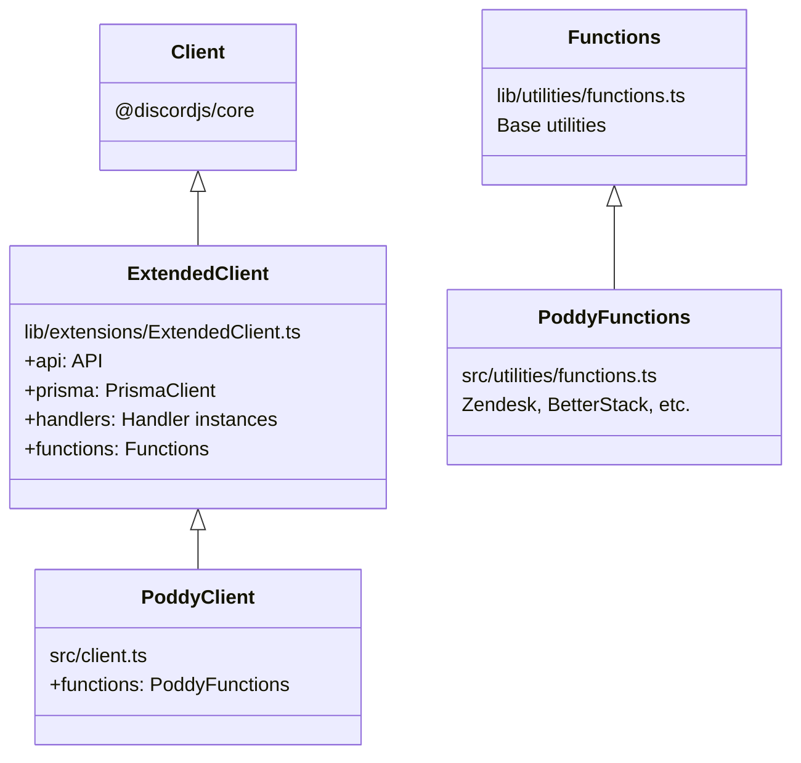

Poddy is built on a layered architecture that separates concerns between a framework layer and bot-specific implementation.

## Core architecture layers

Poddy's architecture consists of two main layers:

<CardGroup cols={2}>
  <Card title="Framework layer" icon="layer-group">
    Located in `lib/`, provides reusable base classes, handlers, and the ExtendedClient foundation.
  </Card>
  <Card title="Bot implementation" icon="bot">
    Located in `src/`, contains Poddy-specific commands, handlers, and business logic.
  </Card>
</CardGroup>

## Directory structure

```
lib/                    Framework layer (reusable)
├── classes/            Base classes for handlers and interactions
├── extensions/         ExtendedClient - core client implementation
└── utilities/          Base Functions class, permissions, utilities

src/                    Bot-specific implementation
├── bot/
│   ├── applicationCommands/    Slash commands and context menus
│   ├── buttons/                Button interaction handlers
│   ├── modals/                 Modal submit handlers
│   ├── selectMenus/            Select menu handlers
│   ├── autoCompletes/          Autocomplete handlers
│   ├── textCommands/           Prefix-based commands
│   └── events/                 Gateway event handlers
├── utilities/          PoddyFunctions, GraphQL, Mastra
└── client.ts           PoddyClient extends ExtendedClient
```

## Class hierarchy

Poddy uses inheritance to extend the base framework with bot-specific functionality:



<Note>
  See [ExtendedClient and PoddyClient](/architecture/client) for details on the client hierarchy.
</Note>

## Handler system

Each interaction type has a dedicated handler that manages loading, routing, and execution:

- **ApplicationCommandHandler** - Slash commands and context menus
- **ButtonHandler** - Button interactions
- **ModalHandler** - Modal submit interactions
- **SelectMenuHandler** - Select menu interactions
- **AutoCompleteHandler** - Command option autocomplete
- **TextCommandHandler** - Prefix-based text commands

<Info>
  All handlers follow a consistent pattern: load → validate → preCheck → run. Learn more in [Handler system](/architecture/handlers).
</Info>

## Interaction routing

Interactions are routed differently based on their type:

**Application commands:** Matched by `${name}-${type}`
```typescript
this.client.applicationCommands.get(`help-1`) // ChatInput command
this.client.applicationCommands.get(`User Info-2`) // User context menu
```

**Component interactions:** Matched by `custom_id.startsWith(handler.name)`
```typescript
// Button with name "upvote" matches custom_id "upvote"
// Button with name "escalateToZendesk" matches "escalateToZendesk.message.123.456.789"
```

<Note>
  See [Interaction routing](/architecture/interaction-routing) for details on custom_id patterns and metadata.
</Note>

## Key integrations

Poddy integrates with several external services through the architecture:

<CardGroup cols={2}>
  <Card title="Prisma ORM" icon="database">
    PostgreSQL database access via `client.prisma`
  </Card>
  <Card title="i18next" icon="language">
    Internationalization via `client.i18n` and LanguageHandler
  </Card>
  <Card title="DataDog" icon="chart-line">
    Metrics and monitoring via `client.dataDog`
  </Card>
  <Card title="Sentry" icon="bug">
    Error tracking via `client.logger.sentry`
  </Card>
</CardGroup>

## Path aliases

The codebase uses TypeScript path aliases for clean imports:

```typescript
import Button from "@lib/classes/Button.js";
import type { PoddyClient } from "@src/client.js";
import { PrismaClient } from "@db/client.js";
```

| Alias | Maps To |
|-------|--------|
| `@lib/*` | `./lib/*` |
| `@src/*` | `./src/*` |
| `@db/*` | `./prisma/__generated__/*` |

## Next steps

<CardGroup cols={2}>
  <Card title="Client architecture" href="/architecture/client" icon="diagram-project">
    Learn about ExtendedClient and PoddyClient
  </Card>
  <Card title="Handler system" href="/architecture/handlers" icon="list-check">
    Understand how handlers work
  </Card>
  <Card title="Interaction routing" href="/architecture/interaction-routing" icon="route">
    Deep dive into custom_id matching
  </Card>
  <Card title="Creating commands" href="/development/commands" icon="code">
    Start building your own commands
  </Card>
</CardGroup>